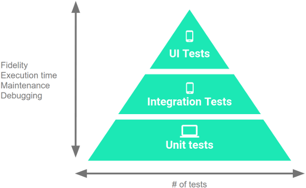

# AndroidTest
测试是Android开发过程中的重要组成部分，通过对APP进行持续的运行测试，你可以在发布之前验证程序的正确性、功能和可用性。

## 测试金字塔
三类测试:Unit tests、Integration tests和UI tests

## Unit Tests（单元测试）
单元测试，包含两种类型：Local tests、Instrumented tests

- **Instrumented tests(仪器测试)**

    1. 指定测试运行器
    @RunWith(AndroidJUnit4.class)

    2. 指定测试的运行时长以及运行频率
    
        @SmallTest  不允许文件文件、数据库、网络。运行时间200ms
    
        @MediumTest 访问文件、数据库。运行时间1000ms
        
        @LargeTest  访问文件、数据库、网络，大多数的UI测试。运行时间1000ms

- **测试框架**

    本项目用到的4种框架：Junit、Mockito、Robolectric、Espresso

    

- **Junit**
    
    [JUnit4](https://junit.org/junit4/)是一个Java语言的单元测试框架。

- **Mockito**
   
   [Mockito](https://site.mockito.org/)是一个mock框架，通过Mockito来mock出其他的依赖对象，用来替换真实的对象，使得待测的目标方法被隔离起来，避免一些外界因素的影响和依赖。
   
- **Robolectric**
   
   [Robolectric](http://robolectric.org/)是三方开源的单元测试框架，通过实现一套JVM能运行的Android代码，然后在unit test运行的时候去截取android相关的代码调用，然后转到自己实现的代码去执行这个调用的过程。
    运行器：@RunWith(RobolectricTestRunner.class)

- **Espresso**
   
   [Espresso](https://developer.android.com/training/testing/espresso/)是Google开源，白盒风格的UI测试工具，运行基于 SDK。
    运行器：@RunWith(AndroidJUnit4.class)

